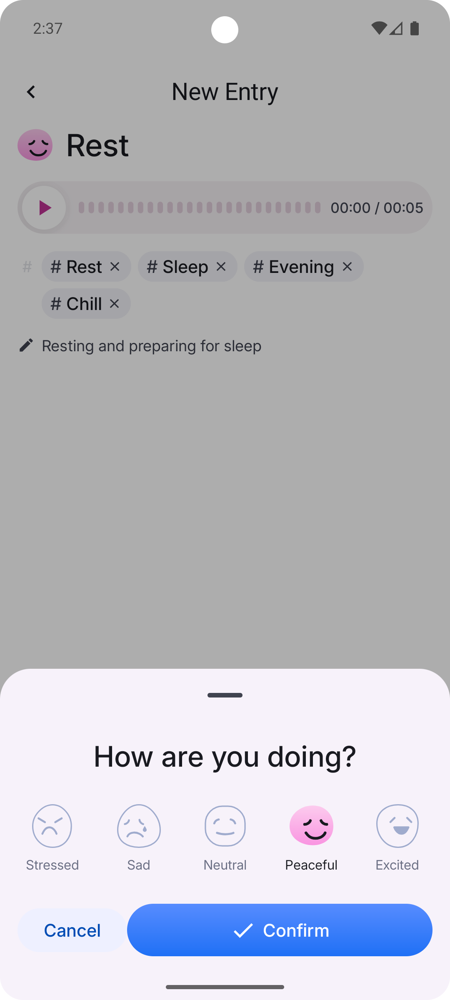
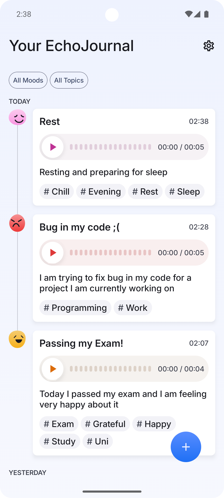
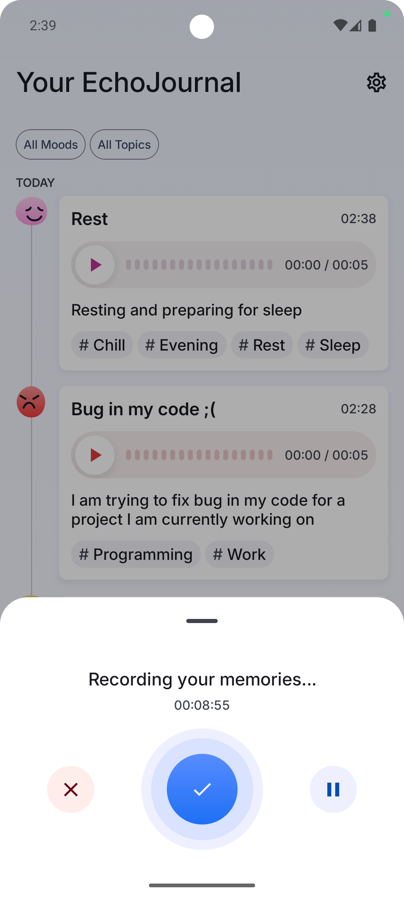
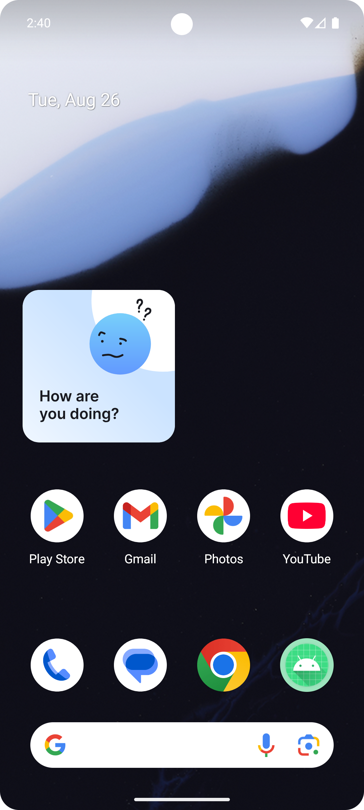

# EchoJournal 🎙️📝📓

**Voice-powered journaling Android app built with Jetpack Compose and modern architecture.**  
EchoJournal is introspective, minimalist voice journaling app developed as part of the **Pl-Coding Mobile Dev Campus in 2025** 🏕️.  
It allows users to record their thoughts, tag them with mood and topics, and save them as personal *echoes*.  
The app is carefully crafted using **Jetpack Compose**, **Koin**, **MVI**, **Room**, **Canvas** and **DataStore**, with full offline support and a strong focus on privacy and reflection.

## ✨ Features & Tech Stack ✨

- ✅ **Jetpack Compose UI** – declarative and responsive user interface  
- ✅ **Material 3 Custom Design System** – custom-styled buttons, chips, dropdowns, and text fields  
- ✅ **Clean Architecture & MVI** – separation of concers with unidirectional data flow ideal for Compose  
- ✅ **Koin Dependency Injection** – clean, idiomatic, and lightweight DI  
- ✅ **Navigation with sealed routes** – type-safe screen transitions  
- ✅ **Room DB (multi-table)** – local database with Echo and Tag relations  
- ✅ **DataStore** – for saving user preferences like default mood and topics  
- ✅ **Glance Widget** – QuickRecord home screen widget
- ✅ **Reactive UI** – state flows exposed from ViewModels via Kotlin `StateFlow`
- ✅ **Voice Recording & Playback** – implemented with `MediaRecorder` and `MediaPlayer` APIs
- ✅ **Canvas Amplitude Visualization** – real-time audio wave rendering
- ✅ **Amplitude Normalization & Resampling** – improves waveform quality  
- ✅ **Custom Bottom Sheet** – for selecting mood and tags
- ✅ **Tagging & Filtering System** – categorize Echoes with hashtags and mood and apply filters to them
- ✅ **Expandable Text** – clean UI for long echo content  
- ✅ **Process Death Survival** – echoes are preserved even after crashes  

---

## 📸 Screenshots

<table>
  <tr>
    <td></td>
    <td></td>
  </tr>
  <tr>
    <td></td>
    <td></td>
  </tr>
</table>
